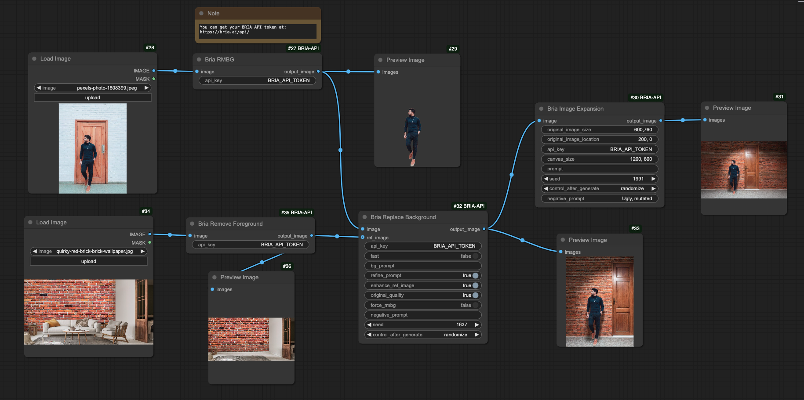
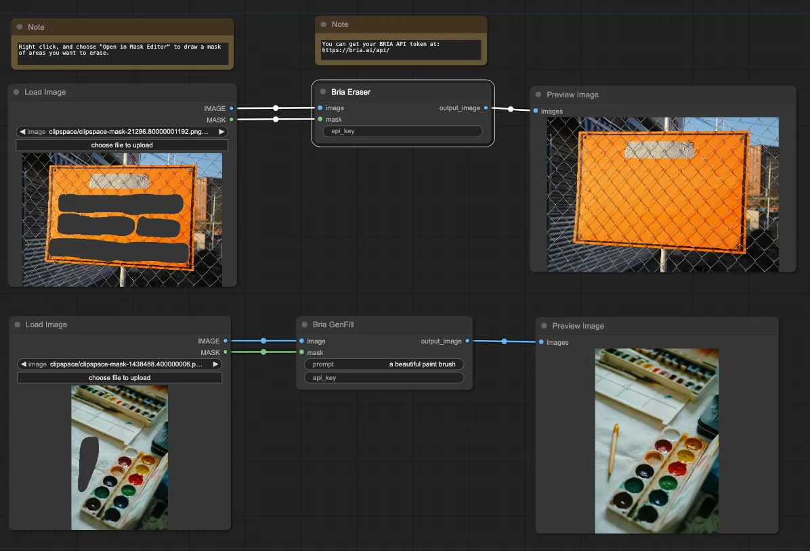
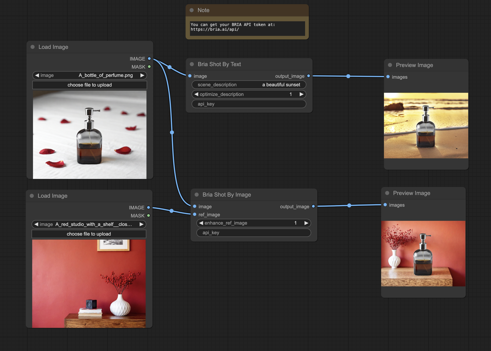

# BRIA ComfyUI API Nodes

<p align="center" style="background-color:black; padding:10px;">
  
</p>

This repository provides custom nodes for ComfyUI, enabling direct access to **BRIA's API endpoints** for image generation and editing workflows. **API documentation** is available [**here**](https://docs.bria.ai/). 

BRIA's APIs and models are built for commercial use and trained on 100% licensed data and does not contain copyrighted materials, such as fictional characters, logos, trademarks, public figures, harmful content, or privacy-infringing content.

An API token is required to use the nodes in your workflows. Get started quickly here
<a href="https://bria.ai/api/" style="text-decoration:none; vertical-align:middle;">
  
</a>.

for direct API endpoint use, you can find our APIs through partners like [**fal.ai**](https://fal.ai/models?keywords=bria).  
For source code and weigths access, go to our [**Hugging Face**](https://huggingface.co/briaai) space.

To load a workflow, import the compatible workflow.json files from this [folder](workflows).  
<p align="center">
  
</p>


<!-- Placeholder image of cool workflows. -->


 <!--   -->

# Available Nodes

## Image Generation Nodes

These nodes allow you to leverage Bria's image generation capabilities within ComfyUI. We offer our latest **V2 nodes** (powered by the **FIBO** model) for precise control via structured prompts, alongside our legacy **V1 nodes**.

### V2 Generation Nodes (FIBO)

Our V2 nodes utilize a state-of-the-art **two-step process** for enhanced control and consistency:

- **Translation**: A VLM Bridge translates your input (prompt/images) into a machine-readable `structured_prompt` (JSON).  
- **Generation**: The FIBO model generates the final image based on that specific JSON.

**Available Versions:**

- **Regular**: Uses **Gemini 2.5 Flash** as the bridge for state-of-the-art, detailed prompt creation.  
- **Lite**: Uses **FIBO-VLM** (Bria's open-source bridge) for faster, flexible, or on-prem deployment.  

**Available V2 Nodes & Input Rules**

We offer three distinct nodes to give you full control over this pipeline:

1. **Structured Prompt Bridge**  
   - Outputs a JSON string only (no image).  
   - This node decouples the "intent translation" step from generation. It is ideal for "human-in-the-loop" workflows where you want to inspect, audit, or version-control the JSON instructions before generating. 
   - **Supported Input Combinations:**  
     - `prompt`: Generates a structured prompt from text.  
     - `images`: Generates a structured prompt based on an input image.  
     - `images + prompt`: Generates a structured prompt based on an image, guided by text.  
     - `structured_prompt + prompt`: Updates an existing structured prompt using new text instructions (outputs updated JSON).  

2. **Generate Image**  
   - Outputs an Image.  
   - The primary node for generation. It automatically handles translation and generation in one go, or accepts a pre-made structured prompt for reproducible results.  
   - **Supported Input Combinations:**  
     - `prompt`: Generates a new image from text.  
     - `images`: Generates a new image inspired by a reference image.  
     - `images + prompt`: Generates a new image inspired by an image and guided by text.  
     - `structured_prompt`: Recreates a previous image exactly (when combined with a seed).  

3. **Refine and Regenerate**  
   - Outputs a Refined Image.  
   - This node allows you to take a result you like and tweak it without losing the original composition. 
   - **Supported Input Combination:**  
     - `structured_prompt + prompt`: Refines a previous image using new text instructions (combined with a seed) to adjust details while maintaining consistency.  

### V1 Generation Nodes (Legacy)

These nodes utilize Bria's previous generation pipeline. While V2 is recommended for the highest control and quality, V1 remains available for backward compatibility with established workflows.  
These nodes create high-quality images using Bria's V1 pipelines, supporting various aspect ratios and styles.

## Tailored Generation Nodes
These nodes use pre-trained tailored models to generate images that faithfully reproduce specific visual IP elements or guidelines.

| Node                   | Description                                                        |
|------------------------|--------------------------------------------------------------------|
| **Tailored Gen**       | Generates images using a trained tailored model, reproducing specific visual IP elements or guidelines. Use the Tailored Model Info node to load the model's default settings. |
| **Tailored Model Info**| Retrieves the default settings and prompt prefix of a trained tailored model, which can be used to configure the Tailored Gen node. |
| **Restyle Portrait**   | Transforms the style of a portrait while preserving the person's facial features. |

## Image Editing Nodes
These nodes modify specific parts of images, enabling adjustments while maintaining the integrity of the rest of the image.

| Node                   | Description                                                        |
|------------------------|--------------------------------------------------------------------|
| **RMBG 2.0 (Remove Background)** | Removes the background from an image, isolating the foreground subject. |
| **Replace Background**  | Replaces an image’s background with a new one, guided by either a reference image or a prompt. |
| **Expand Image**        | Expands the dimensions of an image, generating new content to fill the extended areas. |
| **Eraser**             | Removes specific objects or areas from an image by providing a mask. |
| **GenFill**            | Generates objects by prompt in a specific region of an image. |
| **Erase Foreground**    | Removes the foreground from an image, isolating the background. |

## Product Shot Editing Nodes
These nodes create high-quality product images for eCommerce workflows.

| Node                   | Description                                                        |
|------------------------|--------------------------------------------------------------------|
| **ShotByText**         | Modifies an image's background by providing a text prompt. Powered by BRIA's ControlNet Background-Generation. |
| **ShotByImage**        | Modifies an image's background by providing a reference image. Uses BRIA's ControlNet Background-Generation and Image-Prompt. |

## Attribution Node

| Node                          | Description |
|-------------------------------|-------------------------------------------------------------------------------------------------------------------------------------------------------------------------------------------------------------------------------------------------------------------------------------------------------------------------------------------------------------|
| **Attribution By Image Node** | This node shares generated images via API for Bria to pay attribution to the data owners who contributed to the generation. Once the images are shared with Bria, Bria calculates the attribution, completes the payment on behalf of the user, and erases the images immediately. This node should be included in any workflow using nodes of Bria’s Models (not necessary for Bria’s API nodes). You can also refer to the [**API documentation**]( https://docs.bria.ai/bria-attribution-service/other/postattributionbyimage) |


# Installation
There are two methods to install the BRIA ComfyUI API nodes:

### Method 1: Using ComfyUI's Custom Node Manager
1. Open ComfyUI.
2. Navigate to the [**Custom Node Manager**](https://github.com/ltdrdata/ComfyUI-Manager).
3. Click on 'Install Missing Nodes' or search for BRIA API and install the node from the manager.

### Method 2: Git Clone
1. Navigate to the `custom_nodes` directory of your ComfyUI installation:
   ```bash
   cd path_to_comfyui/custom_nodes
   ```
2. Clone this repository:
   ```bash
   git clone https://github.com/your-repo-link/ComfyUI-BRIA-API.git
   ```

3. Restart ComfyUI and load the workflows.

<!-- ### Campaign generation
Coming soon -->
